<div align="center">
  <h1>ai-expert-teams</h1>
  <p>通用专家团队资产 · 可接入任意 AI agent · 7 个自包含专家团队 · 101 位专家 · 52 个 Skill · 内置 Workflow / 门禁 / Checkpoint</p>
  
  
  
  
  <br />
  <p>
    <a href="https://gitcode.com/badhope/ai-expert-teams">GitCode</a> ·
    <a href="https://gitee.com/badhope/ai-expert-teams">Gitee</a> ·
    <a href="https://github.com/Morningstar202604/ai-expert-teams">GitHub</a>
  </p>
</div>

---

## 这是什么

一套**平台中立的通用专家团队资产**：把 7 个专家团队、101 位专家、52 个 Skill 全部写成纯 Markdown 定义，自带 Workflow、Phase 门禁、Checkpoint 与交接模板。

**无运行时依赖、不绑定任何具体 AI 产品或框架**——任何具备「读取文件 / 派发子 agent / 加载外部提示词」能力的 AI agent，都可以直接读取并扮演这些专家。

> 历史说明：本仓库最初源自 opencode 生态，现已重写为平台中立资产，接入方式与运行时均不再依赖任何特定产品。

---

## 架构图

```mermaid
graph TB
    User["用户指令"]
    PD["project-director<br/>场景路由"]
    subgraph Academic Team
        AL["academic-team-lead<br/>(主理人)"]
        A1["topic-selector"]
        A2["lit-review"]
        A3["journal-adapt"]
        A4["figure-maker"]
        AN["...14 more"]
    end
    subgraph Fullstack Team
        FL["fullstack-team-lead<br/>(主理人)"]
        F1["architecture-designer"]
        F2["ci-cd-pipeline-builder"]
        F3["security-scan"]
        F4["docker-development"]
        FN["...15 more"]
    end
    subgraph Math Team
        ML["math-team-lead<br/>(主理人)"]
        M1["math-modeler"]
        M2["math-solver"]
        M3["math-writer"]
        M4["math-qa-reviewer"]
        MN["...5 more"]
    end
    subgraph Software Dev Team
        SL["software-team-lead<br/>(主理人)"]
        S1["software-architect"]
        S2["software-backend-engineer"]
        S3["software-security-engineer"]
        S4["software-tester"]
        SN["...8 more"]
    end
    subgraph Visual Design Team
        VL["visual-team-lead<br/>(主理人)"]
        V1["poster-designer"]
        V2["illustrator"]
        V3["ecommerce-designer"]
        V4["logo-designer"]
        VN["...10 more"]
    end
    subgraph Content Writing Team
        CL["content-team-lead<br/>(主理人)"]
        C1["article-writer"]
        C2["copywriter"]
        C3["short-video-scriptwriter"]
        C4["seo-writer"]
        CN["...10 more"]
    end
    subgraph Video Production Team
        VDL["video-team-lead<br/>(主理人)"]
        D1["scriptwriter-director"]
        D2["storyboard-artist"]
        D3["editor"]
        D4["motion-graphics"]
        DN["...10 more"]
    end
    User --> PD
    PD -->|"论文/学术"| AL
    PD -->|"Web 应用"| FL
    PD -->|"数学建模竞赛"| ML
    PD -->|"软件开发交付"| SL
    PD -->|"视觉设计"| VL
    PD -->|"内容写作"| CL
    PD -->|"视频制作"| VDL
    AL --- A1 & A2 & A3 & A4 & AN
    FL --- F1 & F2 & F3 & F4 & FN
    ML --- M1 & M2 & M3 & M4 & MN
    SL --- S1 & S2 & S3 & S4 & SN
    VL --- V1 & V2 & V3 & V4 & VN
    CL --- C1 & C2 & C3 & C4 & CN
    VDL --- D1 & D2 & D3 & D4 & DN
```



---

## 快速开始

### 接入你自己的 agent

本仓库是纯 Markdown 资产，**不需要安装脚本、不需要配置文件、不依赖任何特定产品**。按你所用 agent 的能力，三选一接入：

**方式一：直接读团队 Markdown（推荐给读文件型 agent）**

agent 直接读取 `teams/<team>/agents/*.md` 即可获得该专家的完整定义（角色、输入输出规范、Workflow、交接要求），按文件内容扮演对应专家：

```
teams/academic-paper-team/agents/academic-team-lead.md
teams/fullstack-web-team/agents/fullstack-team-lead.md
teams/math-modeling-team/agents/math-team-lead.md
```

无需软链、无需注册，把文件内容喂给 agent 即可。

**方式二：导出 system prompt 后喂入（推荐给只接受单段提示词的 agent）**

运行导出脚本，把各 agent 定义批量导出为 system prompt 文本 / JSON：

```bash
python3 export-agents.py
```

产物默认输出到 `dist/` 目录（每个 agent 一个 system prompt 文件，外加一份汇总 JSON）。把对应 agent 的 system prompt 粘贴到你的 agent 配置，或作为系统提示 / 上下文喂入即可。

**方式三：整目录挂给目录式 agent 框架**

把 `teams/` 目录整体复制（或软链）给支持「目录式加载 agent 定义」的框架——框架只要约定从某一目录发现 `*.md` agent 文件即可。`skills/` 与 `teams/*/skills/` 同理：**skill 目录即资产**，任何 agent 按需读取其中的 `SKILL.md` 即可使用该技能。

> 三种方式任选其一。本仓库不提供、也不需要任何产品专属的安装或配置步骤。

### 直接调用

在支持子 agent 调度的框架中，按**路径 ID**（agent Markdown 文件相对仓库根的路径，去掉 `.md`）派发：

```text
# 多场景自动路由入口（不确定场景时先用它）
project-director

# 明确单一场景 → 直派对应 Team-lead
teams/fullstack-web-team/agents/fullstack-team-lead     # 做个电商 Web 应用上线
teams/math-modeling-team/agents/math-team-lead         # 全程托管国赛赛题
teams/software-dev-team/agents/software-team-lead       # 实现登录模块，设计到测试全走一遍
```

路径 ID 是**平台中立标识符**：任何框架只要能按这个 ID 找到对应 Markdown 文件、并把它作为子 agent 的定义加载，即可调用。团队内部成员由 Team-lead 按 Workflow 编排派发，一般不单独作为入口。

---

## 场景分类

7 个团队按 **4 大类** 组织，`project-director` 按关键词自动路由：

| 大类 | 团队 | 专家数 | 典型场景 |
|------|------|--------|----------|
| **学术研究** | Academic Paper | 19 | 论文选题→文献→方法→写作→审稿→投稿 |
| **学术应用** | Math Modeling | 9 | 国赛/美赛建模竞赛全程托管（72h） |
| **技术开发** | Fullstack Web | 19 | Web 应用全链路：架构→前后端→DevOps→上线 |
| **技术开发** | Software Dev | 12 | 模块拆解→设计→实现→门禁→测试交付 |
| **视觉设计** | Visual Design | 14 | 品牌VI/海报KV/插画/电商图/信息图/PPT |
| **内容创作** | Content Writing | 14 | 长文/公众号/小红书/短视频脚本/文案/SEO |
| **视频制作** | Video Production | 14 | 脚本→分镜→剪辑→包装→音频→字幕→调色→质检 |

---

## 团队总览

| 团队 | 专家数 | 核心场景 | 触发语示例 |
|------|--------|----------|------------|
| **Academic Paper** | 19 位 | 选题 → 文献 → 方法 → 写作 → 审查 → 投稿 | "帮我写篇论文"、"审稿回复" |
| **Fullstack Web** | 19 位 | 架构 → 前后端 → API → DB → DevOps → 测试 → 上线 | "从零做个 Web 应用"、"重构加固" |
| **Math Modeling** | 9 位 | 国赛选题 → 建模 → 求解 → 写作 → 终审交付（72h） | "托管国赛赛题"、"这个题型怎么建" |
| **Software Dev** | 12 位 | 拆解 → 设计 → 实现 → 门禁 → 测试收口 → 交付 | "实现登录模块"、"评审这个 PR" |
| **Visual Design** | 14 位 | 品牌VI → 海报KV → 插画 → 电商图 → 信息图 → PPT → 评审 | "做张海报"、"设计个Logo"、"电商主图" |
| **Content Writing** | 14 位 | 选题策略 → 长文/社媒 → 文案 → 脚本 → SEO → 编辑 → 质检 | "写篇公众号"、"小红书文案"、"短视频脚本" |
| **Video Production** | 14 位 | 脚本 → 分镜 → 剪辑 → 包装 → 音频 → 字幕 → 调色 → 质检复盘 | "做条短视频"、"宣传片"、"口播脚本" |

---

## 核心机制

- **场景路由**：`project-director` 自动识别意图，派发到对应 Team-lead
- **Phase 门禁**：前序 Phase 未完成不得跳后续，`git tag phase-N` + `checkpoint-N.md` 固化
- **并行显式**：Phase 注释「并行派发」，非串行假装并行
- **交接标准**：4 块模板（产出/决策/风险/重点），缺一不可
- **监测断路**：3 轮无新增 = 卡死，同义 = 死循环，自动触发降级/换人/回退
- **技能回退**：调用失败自动退回通用经验，**不阻塞流程**

---

## 仓库结构

```
ai-expert-teams/
├── project-director.md      # 总调度（7 场景路由）
├── export-agents.py         # 导出脚本：把各 agent 定义导出为 system prompt 文本 / JSON
├── dist/                    # 导出产物目录（gitignore，不入库）
├── SKILLS_INDEX.md          # 52 个 skill 统一索引
├── AGENTS.md                # 使用手册
├── skills/                  # 已实装（通用 14 + 团队 38）
│   ├── web-search/
│   ├── deep-research/
│   ├── security-scan/
│   ├── deep-security-scan/
│   ├── performance-profiler/
│   ├── ci-cd-pipeline-builder/
│   ├── frontend-app-builder/
│   ├── frontend-testing-debugging/
│   ├── api-design-reviewer/
│   ├── test-case-generator-v2/
│   ├── uml-and-software-architecture-visualization/
│   ├── accuracy-and-fact-check/
│   ├── cross-validation-guide/
│   └── quality-gate-checklist/
└── teams/
    ├── academic-paper-team/ # 19 专家（含 core-researcher + core-fact-checker 通用单兵）
    │   ├── agents/
    │   ├── skills/          # 7 个团队专用 skill（已实装）
    │   └── TEAM.md
    ├── fullstack-web-team/  # 19 专家 + 4 core 单兵
    │   ├── agents/
    │   ├── skills/          # 11 个团队专用 skill（已实装）
    │   └── TEAM.md
    ├── math-modeling-team/  # 9 专家（国赛专用）
    │   ├── agents/
    │   ├── skills/          # 2 个（math-modeling-guosai / selfcheck，已实装）
    │   └── TEAM.md
    ├── software-dev-team/   # 12 专家
    │   ├── agents/
    │   └── TEAM.md          # 无独立 skill，引用通用 skills/ 中 3 个
    ├── visual-design-team/  # 14 专家
    │   ├── agents/
    │   ├── skills/          # 6 个团队专用 skill（已实装）
    │   └── TEAM.md
    ├── content-writing-team/ # 14 专家
    │   ├── agents/
    │   ├── skills/          # 6 个团队专用 skill（已实装）
    │   └── TEAM.md
    └── video-production-team/ # 14 专家
        ├── agents/
        ├── skills/          # 6 个团队专用 skill（已实装）
        └── TEAM.md
```

---

## License

[MIT](LICENSE)
