<div align="center">
  <h1>opencode-expert-teams</h1>
  <p>4 个自包含专家团队 · 58 位专家 · 31 Skill · 内置 Workflow / 门禁 / Checkpoint</p>
  
  
  
  
  <br />
  <p>
    <a href="https://github.com/X33834/opencode-expert-teams">GitHub</a> ·
    <a href="https://gitcode.com/badhope/opencode-expert-teams">GitCode</a> ·
    <a href="https://gitee.com/badhope/opencode-expert-teams">Gitee</a>
  </p>
</div>

---

## 架构图

```mermaid
graph TB
    User["用户指令"]
    PD["project-director<br/>场景路由"]
    subgraph Academic Team
        AL["academic-team-lead<br/>(主理人)"]
        A1["topic-selector"]
        A2["lit-review"]
        A3["journal-adapt"]
        A4["figure-maker"]
        AN["...14 more"]
    end
    subgraph Fullstack Team
        FL["fullstack-team-lead<br/>(主理人)"]
        F1["architecture-designer"]
        F2["ci-cd-pipeline-builder"]
        F3["security-scan"]
        F4["docker-development"]
        FN["...15 more"]
    end
    subgraph Math Team
        ML["math-team-lead<br/>(主理人)"]
        M1["math-modeler"]
        M2["math-solver"]
        M3["math-writer"]
        M4["math-qa-reviewer"]
        MN["...5 more"]
    end
    subgraph Software Dev Team
        SL["software-team-lead<br/>(主理人)"]
        S1["software-architect"]
        S2["software-backend-engineer"]
        S3["software-security-engineer"]
        S4["software-tester"]
        SN["...8 more"]
    end
    User --> PD
    PD -->|"论文/学术"| AL
    PD -->|"Web 应用"| FL
    PD -->|"数学建模竞赛"| ML
    PD -->|"软件开发交付"| SL
    AL --- A1 & A2 & A3 & A4 & AN
    FL --- F1 & F2 & F3 & F4 & FN
    ML --- M1 & M2 & M3 & M4 & MN
    SL --- S1 & S2 & S3 & S4 & SN
```



---

## 快速开始

### 安装（一键脚本，推荐）

```bash
git clone https://gitcode.com/badhope/opencode-expert-teams.git
cd opencode-expert-teams
./install.sh              # 实际安装（软链 agents + 全部 skills）
./install.sh --dry-run    # 预览将执行的操作，不实际修改
```

脚本会自动：
1. 将仓库根软链到 `~/.config/opencode/agents`
2. 遍历 `teams/*/skills/*` 和 `skills/*`，逐个软链到 `~/.config/opencode/skills/<name>/`
3. 验证安装结果（agent 数 + skill 数）

> 幂等：重复执行不会产生重复软链，`ln -sfn` 自动覆盖。

### 直接调用

```bash
# 学术论文全流程
opencode run --agent project-director "帮我从选题到投稿写篇论文"

# 全栈 Web 应用交付
opencode run --agent teams/fullstack-web-team/agents/fullstack-team-lead "做个电商 Web 应用上线"

# 数学建模国赛全程托管
opencode run --agent teams/math-modeling-team/agents/math-team-lead "帮我全程托管这个国赛赛题"

# 软件开发交付（设计→实现→门禁→测试）
opencode run --agent teams/software-dev-team/agents/software-team-lead "帮我实现登录模块，从设计到测试全走一遍"
```

---

## 团队总览

| 团队 | 专家数 | 核心场景 | 触发语示例 |
|------|--------|----------|------------|
| **Academic Paper** | 18 位 | 选题 → 文献 → 方法 → 写作 → 审查 → 投稿 | "帮我写篇论文"、"审稿回复" |
| **Fullstack Web** | 19 位 | 架构 → 前后端 → API → DB → DevOps → 测试 → 上线 | "从零做个 Web 应用"、"重构加固" |
| **Math Modeling** | 9 位 | 国赛选题 → 建模 → 求解 → 写作 → 终审交付（72h） | "托管国赛赛题"、"这个题型怎么建" |
| **Software Dev** | 12 位 | 拆解 → 设计 → 实现 → 门禁 → 测试收口 → 交付 | "实现登录模块"、"评审这个 PR" |

---

## 核心机制

- **场景路由**：`project-director` 自动识别意图，派发到对应 Team-lead
- **Phase 门禁**：前序 Phase 未完成不得跳后续，`git tag phase-N` + `checkpoint-N.md` 固化
- **并行显式**：Phase 注释「并行 Task 调用」，非串行假装并行
- **交接标准**：4 块模板（产出/决策/风险/重点），缺一不可
- **监测断路**：3 轮无新增 = 卡死，同义 = 死循环，自动触发降级/换人/回退
- **技能回退**：调用失败自动退回通用经验，**不阻塞流程**

---

## 仓库结构

```
opencode-expert-teams/
├── project-director.md      # 总调度（4 场景路由）
├── SKILLS_INDEX.md          # 31 skill 统一索引
├── AGENTS.md                # 使用手册
├── install.sh               # 一键安装脚本（agents + skills 软链）
├── opencode.json            # opencode 配置（skill 权限全开）
├── skills/                  # 通用 skill（8 个，全团队共用）
│   ├── web-search/
│   ├── deep-research/
│   ├── security-scan/
│   ├── deep-security-scan/
│   ├── performance-profiler/
│   ├── ci-cd-pipeline-builder/
│   ├── frontend-app-builder/
│   └── frontend-testing-debugging/
└── teams/
    ├── academic-paper-team/ # 18 专家
    │   ├── agents/
    │   ├── skills/          # 7 个团队专用 skill
    │   └── TEAM.md
    ├── fullstack-web-team/  # 19 专家 + 4 core 单兵
    │   ├── agents/
    │   ├── skills/          # 11 个团队专用 skill
    │   └── TEAM.md
    ├── math-modeling-team/  # 9 专家（国赛专用）
    │   ├── agents/
    │   ├── skills/          # 2 个（math-modeling-guosai / selfcheck）
    │   └── TEAM.md
    └── software-dev-team/   # 12 专家
        ├── agents/
        ├── skills/          # 3 个团队专用 skill
        └── TEAM.md
```

---

## License

[MIT](LICENSE)
