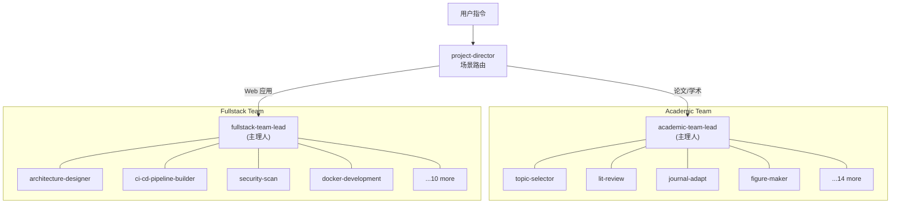

<div align="center">
  <h1>opencode-expert-teams</h1>
  <p>2 个自包含专家团队 · 33 位专家 · 50+ Skill · 内置 Workflow / 门禁 / Checkpoint</p>
  
  
  
  
  <br />
  <p>
    <a href="https://github.com/X33834/opencode-expert-teams">GitHub</a> ·
    <a href="https://gitcode.com/badhope/opencode-expert-teams">GitCode</a> ·
    <a href="https://gitee.com/badhope/opencode-expert-teams">Gitee</a>
  </p>
</div>

---

## 架构图



---

## 快速开始

### 安装（推荐：软链接，便于后续更新）

```bash
git clone https://github.com/X33834/opencode-expert-teams.git
ln -sfn "$(pwd)/opencode-expert-teams" ~/.config/opencode/agents
```

### 直接调用

```bash
# 学术论文全流程
opencode run --agent project-director "帮我从选题到投稿写篇论文"

# 全栈 Web 应用交付
opencode run --agent teams/fullstack-web-team/agents/fullstack-team-lead "做个电商 Web 应用上线"
```

---

## 团队总览

| 团队 | 专家数 | 核心场景 | 触发语示例 |
|------|--------|----------|------------|
| **Academic Paper** | 18 位 | 选题 → 文献 → 方法 → 写作 → 审查 → 投稿 | "帮我写篇论文"、"审稿回复" |
| **Fullstack Web** | 15 位 | 架构 → 前后端 → API → DB → DevOps → 测试 → 上线 | "从零做个 Web 应用"、"重构加固" |

---

## 核心机制

- **场景路由**：`project-director` 自动识别意图，派发到对应 Team-lead
- **Phase 门禁**：前序 Phase 未完成不得跳后续，`git tag phase-N` + `checkpoint-N.md` 固化
- **并行显式**：Phase 注释「并行 Task 调用」，非串行假装并行
- **交接标准**：4 块模板（产出/决策/风险/重点），缺一不可
- **监测断路**：3 轮无新增 = 卡死，同义 = 死循环，自动触发降级/换人/回退
- **技能回退**：调用失败自动退回通用经验，**不阻塞流程**

---

## 仓库结构

```
opencode-expert-teams/
├── project-director.md      # 总调度
├── SKILLS_INDEX.md          # 50+ skill 统一索引
├── AGENTS.md                # 使用手册
└── teams/
    ├── academic-paper-team/ # 18 专家
    │   ├── agents/
    │   ├── skills/
    │   └── TEAM.md
    └── fullstack-web-team/  # 15 专家 + 4 core 单兵
        ├── agents/
        ├── skills/
        └── TEAM.md
```

---

## License

[MIT](LICENSE)
