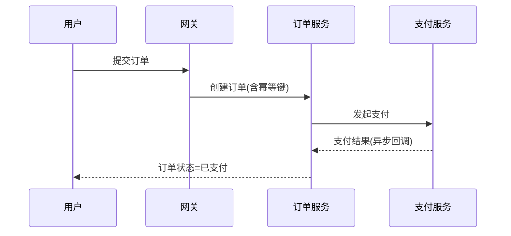
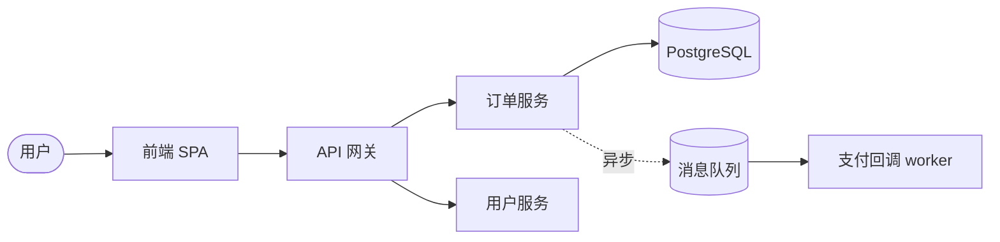

# UML 与软件架构可视化

本 skill 供 **software-architect** 在设计阶段产出配套图表。图不是装饰：每张图必须服务于一个决策（边界划分、调用顺序、数据流向、部署拓扑），且与 ADR/接口契约文字严格一致，能被评审者直接照着讨论。

## 这是什么
一套用 Mermaid（优先，可在 Markdown 直接渲染）或 PlantUML 表达架构与设计的规范。约定图种、元素语义、命名与分层，避免画出「看不出决策」的示意图。

## 何时使用
- W2 仅设计阶段：architect 产出模块边界、接口契约、备选方案，需要配图说明。
- 评审前把关键流程画成时序图，让 reviewer/qa 一眼看懂交互。
- 向新人或跨团队解释系统结构、部署拓扑。

## 核心步骤
1. **先选图种再画图**：想清这张图要回答什么问题，再选对应图，不为画图而画图。
2. **分层表达**：用 C4 思路——上下文（外部谁在用）→ 容器（进程/服务）→ 组件（模块内部分块）。
3. **标注关系语义**：依赖方向、同步/异步、调用协议、数据流向都要标出来。
4. **与文字对齐**：图中出现的每个组件/类/接口名，必须在 ADR 或接口文档里能找到。
5. **可渲染校验**：Mermaid 代码块语法正确，字段名/别名不冲突，导出后不破版。

## 图种选择指南
| 想说明的问题 | 用图 | 关键元素 |
|--------------|------|----------|
| 系统和外部参与者关系 | C4 上下文图 | 人、外部系统、本系统边界 |
| 进程/服务部署与技术栈 | 容器/部署图 | 服务、DB、MQ、网关、节点 |
| 模块内部分层与依赖 | 组件图 | 模块、依赖箭头方向 |
| 对象结构与职责 | 类图 | 类、属性/方法、继承/聚合 |
| 一次业务交互的步骤 | 时序图 | 参与者、消息、同步/异步、返回 |
| 状态流转 | 状态机图 | 状态、事件触发迁移 |

## Mermaid 模板（时序图）

## Mermaid 模板（C4 容器图思路）

## 清单
- [ ] 每张图标题写明「它要回答的决策问题」。
- [ ] 依赖箭头方向正确（上游 → 下游），没有成环。
- [ ] 同步实线箭头、异步虚线箭头区分清楚。
- [ ] 图中每个命名在文字文档里有定义，不出现孤立项。
- [ ] 技术栈/中间件在图中标注，评审者不用猜。
- [ ] Mermaid 代码块可直接渲染，无语法错误。

## 易错点
- **画成全家桶示意图**：一张图塞进所有组件，密密麻麻却没表达任何决策。应按 C4 分层拆多张。
- **图与文不一致**：图里画了「缓存层」，ADR 文字里根本没提缓存，评审对不上。
- **箭头方向反了**：把「谁调用谁」画反，误导读者对依赖方向的判断。
- **异步画成同步**：MQ 解耦的链路画成同步调用，错误表达了系统耦合度。
- **过度 UML 仪式**：内部小工具也要画全套六张图。图服务于决策，决策简单就少画。
- **命名不统一**：同一组件在不同图里叫不同名字（Order / 订单服务 / order-svc）。全程用一个名。
